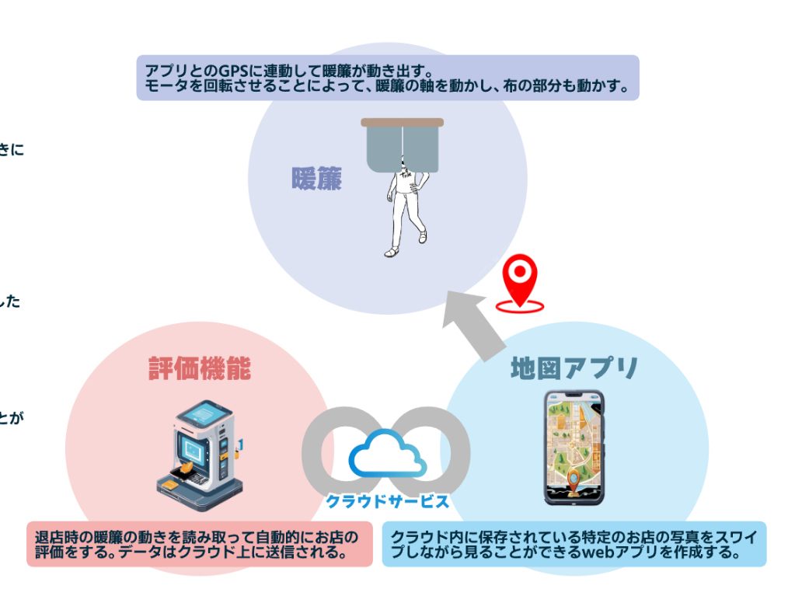

# PITARINKO

## Overview
PITARINKOは、店舗の場所や雰囲気をユーザーに伝えることを目的とした
IoT × Webアプリケーションシステムです。

ユーザーはWebアプリを利用して店舗を検索し、実際の店舗に近づくと
センサーデバイスによって暖簾（のれん）がインタラクティブに動きます。

ユーザーは退店時の暖簾をくぐる動作を通じて店舗の評価を送信することができ、
その情報はサーバーを通してアプリケーションに反映されます。

また、店舗内で撮影された写真をWebアプリで閲覧することができ、
ユーザーは店舗の雰囲気を事前に知ることができます。

---

## Demo Video

[Watch Demo](./document/PITARINKO_DEMO.mp4)

---

## System Architecture

本システムは以下の3つの要素で構成されています。

- IoTデバイス（Spresense）
- サーバー
- Webアプリケーション（React）

デバイスがユーザーの動きを検知し、サーバーを通して
Webアプリケーションへデータを送信します。

---

## Tech Stack

### Hardware
- Sony Spresense
- センサーデバイス
- モーター（暖簾動作）

### Backend
- Node.js
- HTTP Server
- Firebase

### Frontend
- React
- Vite
- Google Map API

---

## Features

### 店舗検索
ユーザーはWebアプリから店舗を検索できます。

### インタラクティブ暖簾
店舗に近づくと暖簾が動き、ユーザーを案内します。

### ジェスチャー評価
暖簾をくぐる動作によって店舗評価を送信できます。

### 店舗写真閲覧
ユーザーは店舗の写真をアプリから閲覧できます。

---

## Project Structure

