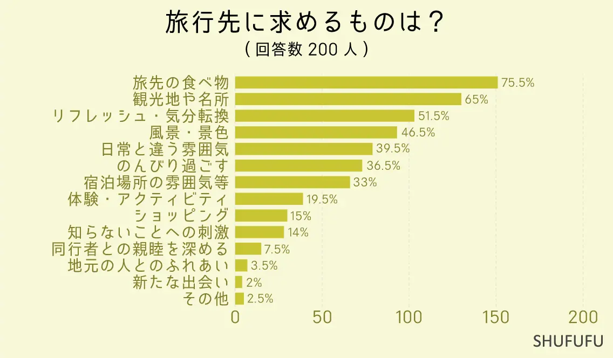

# ぴたりんこ！ (Pitarinko!)
> **「暖簾（のれん）」が導く、新しい街歩きと店選びの体験** 「ぴたりんこ！」は、ソニーのSpresenseとWeb技術を組み合わせ、飲食店の「入り口」と「出口」をインタラクティブに変えるプロダクトです。観光客の不安を解消し、観光地での体験価値を最大化することを目指しています。

---

## 📺 Demo
実際の動作の様子（暖簾の動きやアプリ操作）は、以下のデモ動画からご確認いただけます。

### [▶️ デモ動画を再生する (document/PITARINKO_DEMO.mp4)](document/PITARINKO_DEMO.mp4)

---

## 📌 Vision & Problem (なぜ作ったのか)

### 街の景色を楽しむ「余裕」を取り戻す

観光地において、旅行者が大切にする要素は「旅先の食べ物（75.5%）」「風景・景色（46.5%）」「リフレッシュ・気分転換（51.5%）」といった五感を使用した体験です。しかし、現状では多くの旅行者がスマートフォンの地図アプリと睨めっこしながら移動しており 、せっかくの街並みを見落としてしまうという課題と考えました。

### 観光客の「店選び」と「認知」の壁
特に個人経営店などは「雰囲気が分からず入りにくい」「知名度が低く見つけにくい」といった理由から 、客足の低下を招いています。
* **体験のミスマッチ**: Google Mapの写真（50%）を頼りに店を選んでも、実際の雰囲気が伝わらず「思っていたのと違う」という乖離が発生しています。

私たちは、日本の伝統的なインターフェースである**「暖簾（のれん）」**に着目しました。暖簾をデジタル化することで、街の風景に溶け込みながら、直感的なナビゲーションとフィードバックを実現します。

---

## ✨ Core Features (ユーザー体験)

### 1. Welcome Interaction (手招きする暖簾)
ユーザーがアプリを使用して店舗に近づくと、暖簾が自動で動き出します。
* **体験**: スマートフォンを閉じ、町の景色を見ながら歩いていても、視覚的に「この店だ！」と気づくことができます。まるで暖簾が「手招き」しているような動きは、観光客に目的地に辿り着いた「安心」と「おもしろさ」を届けます。
* **技術**: SpresenseでGPS距離を比較し、モーターで暖簾を上下させることで招く動作を再現します 。 

### 2. Gesture Feedback (くぐるだけの直感評価 & 心理的投稿動線)
退店時の「暖簾をくぐる」という日常的で自然な動作を評価システムに落とし込み、投稿のハードルを極限まで下げました。

* **心理学的アプローチ（フット・イン・ザ・ドア）**: 
  「暖簾をくぐって店を出る」という心理的障壁の低いアクションによって、無意識のうちに店舗評価という「小さなコミットメント」を完了させます。これにより心理学的な**一貫性の原理**が働き、「せっかく評価したのだから、ついでに写真も投稿しよう」というポジティブな心理状態へユーザーを誘導し、投稿の心理的負担を軽減させます。

* **SNSライクなUI**: 
  投稿画面はTikTokやInstagramなどの若年層が慣れ親しんだSNSに近いUIを採用。リール動画のような形式で直感的に写真をアップロード・閲覧可能にすることで、質の高い視覚的情報の蓄積とコミュニティの活性化を促進します。

* **技術（Edge AIによるジェスチャ解析）**: 
  Spresenseカメラによる画像認識（Edge AI）を活用しています。右手・左手・非動作時を各1,000データ以上学習させた高精度モデルを構築。
  - **ロジック**: 「おいしかった（1）」または「期待と違った（0）」という直感的な2値評価をSpresense内で瞬時に判別。
  - **マッピング**: この解析結果を既存の5段階評価システムに正規化（例：1→★5）してクラウドへ送信することで、ユーザーに「入力を意識させない評価体験」を提供しています。

---
## 提供価値 (Value Proposition)

### 循環する信頼：投稿の連鎖が作る『選ばれる店』の好循環

#### 1. スマホから解放される「観光体験の最大化」
* **脱・地図アプリ**: 暖簾が物理的に手招きすることで、観光客はスマートフォンの地図と睨めっこする手間から解放され、本来の目的である「街の景色」を楽しみながら移動できます。
* **直感的な発見**: 視覚的に分かりやすい暖簾の動きが、偶然の出会いや新しい店舗への入店を促します。

#### 2. 「一貫性の原理」がもたらす情報の質と量
* **無意識のコミットメント**: 「暖簾をくぐる」という日常動作を評価（小さなコミットメント）に変換することで、心理的な一貫性が働き、ユーザー自身が「自然と写真も投稿しよう」と思える動線を構築しました。
* **「ついで」が作る意思決定支援**: この「ついで」の行動によって集まった膨大な写真と評価は、次にその街を訪れる観光客にとって、失敗しない店選びのための「最も信頼できる判断基準」となります。

#### 3. 三方よしのエコシステム
* **ユーザー**: スマホから目を離して街を楽しみ、ストレスなく思い出をシェアできる。
* **次の観光客**: 信頼できる視覚情報に基づき、ミスマッチのない直感的な店選びができる。
* **店舗**: 顧客との自然な接点を通じて、自店の「雰囲気」という無形の魅力が自動的に蓄積・発信されていく。

## 🛠 System Architecture

エッジ（Spresense）とクラウド（Firebase）を中継サーバーを介して連携させ、柔軟なデータ処理が可能な設計にしています。

| コンポーネント | 使用技術 | 役割 |
| :--- | :--- | :--- |
| **Edge Device** | **Sony Spresense** |GPS取得、モーター制御、カメラ画像認識  |
| **Backend** | **Server (Node.js)** | GPS用・評価用サーバーをそれぞれ立て、送受信の仲介・頻度を制御 |
| **Cloud** | **Firebase** | 店舗評価データ・写真情報の保存（Storage） |
| **Front-end** | **Web App (React/TS)** | 地図ナビおよび投稿写真・評価の閲覧 |

---

## 🚀 Implementation Details (実装の工夫)

* **データ収集の一貫性**: AIによる画像処理の高精度化のため、撮影時にモニターにグリッド線を表示し、本番環境に近い条件で学習データを収集しました。
* **直感的なナビゲーション**: 一目で「案内中」であることが伝わる色使いや配置を工夫し、言語の壁を超えたUIを目指しました。
* **スケーラブルな通信**: 各中継サーバーを介することで、データ送受信の間に処理を加えたり、更新頻度を動的に変更できる構成にしました。

---

## 📅 Hackathon Details
* **イベント名**: Sensing Solution ハッカソン 2024 
* **チーム名**: で座高 

## 引用
旅行先に求めるもの：https://prtimes.jp/main/html/rd/p/000000037.000135215.html
Googleマップに掲載されている店舗情報の特に何を参考にしますか？：https://prtimes.jp/main/html/rd/p/000000112.000039683.html
